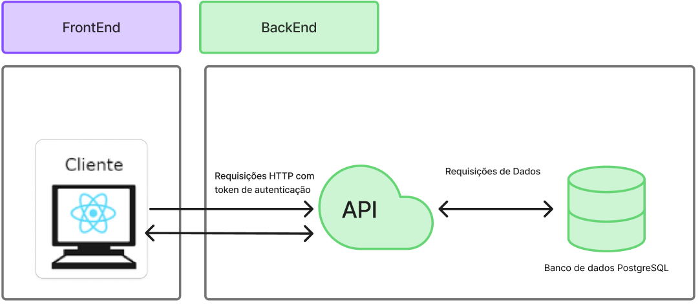
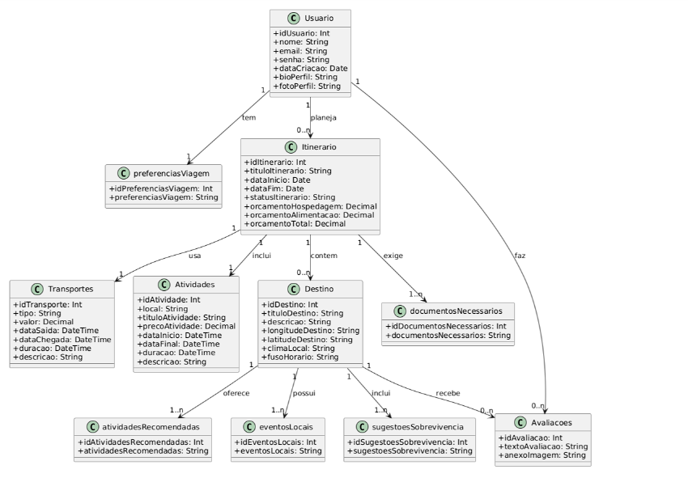
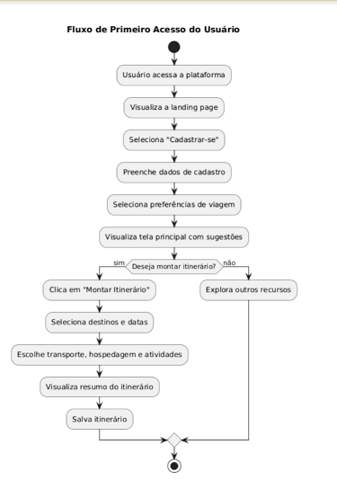
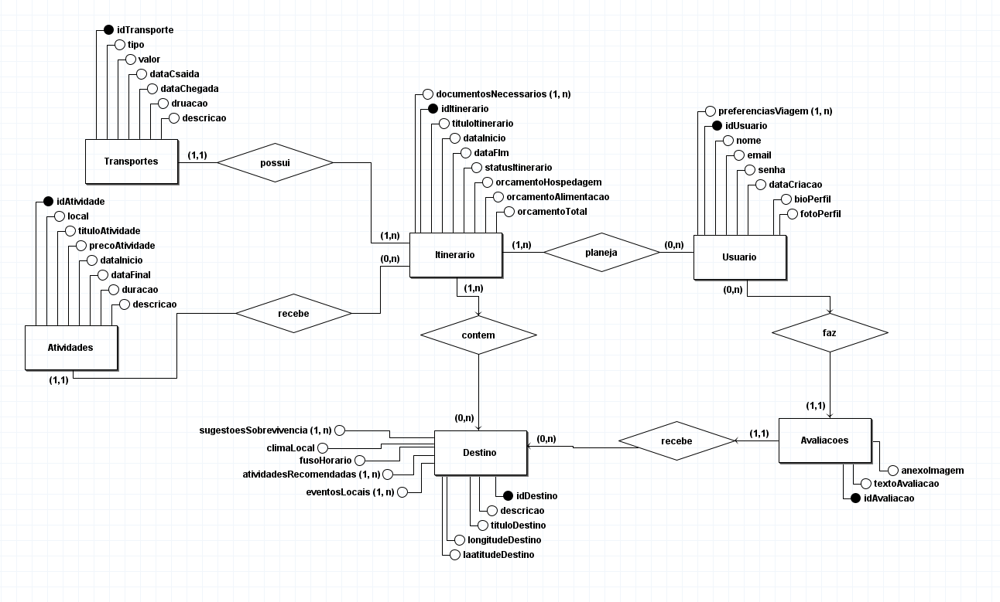
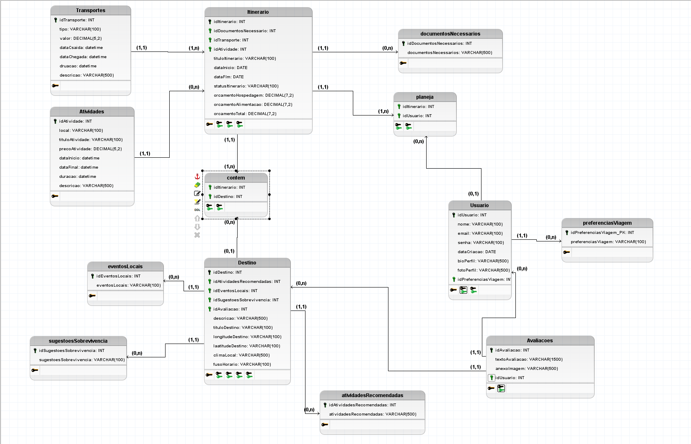

# Documento de Arquitetura

## Documento de Arquitetura de Software

### 1 Introdução

Este documento tem como finalidade descrever a arquitetura de software do projeto Vai Pela Sombra, uma aplicação web voltada para o planejamento de viagens com foco em recomendações personalizadas, eventos locais e dicas culturais. A arquitetura descrita aqui visa fornecer uma visão clara das decisões técnicas e estruturais adotadas no sistema, servindo como referência para desenvolvedores, arquitetos de software, gerentes de projeto e demais partes interessadas.

#### 1.1 Finalidade

Este documento tem como finalidade descrever a arquitetura de software do projeto Vai Pela Sombra, uma aplicação web voltada para o planejamento de viagens com foco em recomendações personalizadas, eventos locais e dicas culturais. A arquitetura descrita aqui visa fornecer uma visão clara das decisões técnicas e estruturais adotadas no sistema, servindo como referência para desenvolvedores, arquitetos de software, gerentes de projeto e demais partes interessadas.

#### 1.2 Escopo

O projeto está estruturado em uma arquitetura monolítica, com separação entre frontend e backend, ambos hospedados como uma única aplicação integrada.

- **Frontend**: construído com React e TypeScript, responsável pela interface do usuário.
- **Backend:**  desenvolvido em Node.js com TypeScript e Express, sendo responsável pela lógica de negócios, autenticação e interação com o banco de dados.
- **API Gateway/Serviço de Integração:** também desenvolvido em Node.js, será responsável pela exposição dos dados e funcionalidades da aplicação de forma centralizada e segura.
- **Banco de Dados:** PostgreSQL, centralizando as informações sobre usuários, destinos, interesses, eventos, entre outros dados relevantes para o planejamento de viagens.

A aplicação tem como objetivo:

- Permitir que usuários cadastrem seus interesses;

- Oferecer recomendações personalizadas de destinos;

- Exibir eventos locais nos destinos selecionados;

- Fornecer dicas culturais, de saúde e segurança para viajantes;

- Possibilitar o agendamento de itinerários personalizados de viagens;

- Permitir o planejamento de viagens em grupo, facilitando a organização conjunta de roteiros e atividades.

#### 1.3 Visão Geral

Este documento está estruturado em seções que abrangem a representação geral da arquitetura, metas e restrições, visões lógica e de implementação, bem como considerações de desempenho e qualidade. Também são apresentados os principais diagramas que sustentam as decisões arquiteturais, como o Diagrama de Entidade-Relacionamento e o Diagrama Lógico de Dados.

### 2 Representação da Arquitetura

A arquitetura utilizada no projeto será baseada em um modelo monolítico. Essa abordagem concentra os componentes da aplicação (frontend e backend) em uma única base de código, promovendo simplicidade no desenvolvimento e no gerenciamento inicial do sistema. A comunicação entre as camadas é interna, eliminando a necessidade de mecanismos de rede complexos. Essa escolha reduz a sobrecarga operacional e favorece uma entrega mais ágil nas etapas iniciais do projeto.

#### 2.1 Diagrama de Relações

 

*Fonte: [Pablo Guilherme](https://github.com/PabloGJBS)*

### 3 Metas e Restrições de Arquitetura

Nesta seção, são descritas as principais metas e restrições que guiam a arquitetura do sistema *Vai Pela Sombra*. As decisões aqui documentadas têm impacto direto sobre a escolha de tecnologias, frameworks, práticas de segurança, escopo funcional e usabilidade da aplicação. Essas restrições visam garantir a padronização do desenvolvimento, a consistência entre os módulos da aplicação monolítica e o cumprimento dos requisitos não funcionais definidos.

A seguir, apresenta-se uma tabela com as principais restrições técnicas e metas do projeto:

| Restrição   | Ferramenta/Descrição |
|-------------|----------------------|
| **Linguagem** | TypeScript (frontend e backend) |
| **Framework** | React (Frontend), Node.js + Express (Backend)| 
| **Plataforma** | Web responsiva (navegador desktop e mobile) |
| **Segurança** | Os usuários serão autenticados via token JWT, com verificação em cada requisição feita ao backend via API Gateway. O acesso a funcionalidades como criação de itinerários e gerenciamento de grupos será restrito a usuários autenticados. |
| **Idioma** | Português (com possibilidade futura de suporte multilíngue) |

### 4. Visão Lógica

#### 4.1 Visão geral: Pacotes e Camadas

A aplicação Vai Pela Sombra adota uma arquitetura monolítica, com separação clara entre as camadas de frontend (interface do usuário) e backend (lógica de negócios), mas mantidas em uma única aplicação unificada. Essa abordagem centraliza a gestão do sistema e facilita a implantação, sendo ideal para o estágio atual do projeto.

#### 4.1.1 Model

A camada de Model representa a estrutura dos dados da aplicação e é responsável pela comunicação com o banco de dados PostgreSQL. Utilizando ORMs como Sequelize ou Prisma, essa camada permite abstrair as operações de leitura e escrita no banco, facilitando a manutenção e evitando dependências diretas com a estrutura relacional. Cada microserviço possui seus próprios modelos (ex: Usuário, Destino, Evento, Grupo).

#### 4.1.2 Controller

Os Controllers são responsáveis por receber as requisições HTTP, processar a lógica de negócio e ccoordenar a interação entre o Model e a resposta enviada ao cliente diretamente pelo servidor backend. Essa camada centraliza a validação dos dados, chamadas de serviços auxiliares, regras de autenticação/autorização e tratamento de exceções.

#### 4.1.3 View

A camada de View, no contexto do backend, é representada pelas respostas formatadas em JSON que são retornadas aos consumidores da API. Já a View completa da aplicação é implementada no frontend, utilizando os recursos do React para apresentar dados ao usuário de forma interativa, responsiva e dinâmica. O React atua tanto como template quanto como controlador local de estado de interface.

#### 4.2 Diagrama de classes UML

<em>Fonte: <a href="https://github.com/PabloGJBS">Pablo Guilherme</a></em>

#### 4.3 Fluxograma 1

<em>Fonte: <a href="https://github.com/PabloGJBS">Pablo Guilherme</a></em>

### 5 Visão de Implementação

#### 5.1 DeR - Diagrama Entidade e Relacionamento

A seguir apresentamos o Diagrama Entidade Relacionamento do projeto

<em>Fonte: <a href="https://github.com/PabloGJBS">Pablo Guilherme</a></em>

Descrição do Diagrama Entidade-Relacionamento (DER)

#### **Usuário**

- **idUsuario** (PK): Identificador único do usuário.
- **nome**: Nome completo do usuário.
- **email**: Endereço de e-mail do usuário.
- **senha**: Senha do usuário.
- **dataCriacao**: Data de criação do cadastro.
- **bioPerfil**: Texto descritivo sobre o usuário.
- **fotoPerfil**: Caminho ou URL da foto de perfil.
- **preferenciasViagem**: Lista de preferências (ex: aventura, cultura, descanso etc.).

#### **Itinerário**

- **idItinerario** (PK): Identificador único do itinerário.
- **tituloItinerario**: Nome dado ao itinerário.
- **dataInicio**: Data de início do planejamento.
- **dataFim**: Data de fim do planejamento.
- **statusItinerario**: Estado atual do itinerário (planejado, em andamento, concluído).
- **orcamentoHospedagem**: Valor reservado para hospedagem.
- **orcamentoAlimentacao**: Valor reservado para alimentação.
- **orcamentoTotal**: Soma total dos custos estimados.
- **documentosNecessarios**: Lista de documentos relevantes.

#### **Destino**

- **idDestino** (PK): Identificador único do destino.
- **tituloDestino**: Título ou nome do destino.
- **descricao**: Descrição textual.
- **longitudeDestino / latitudeDestino**: Coordenadas geográficas.
- **climaLocal**: Descrição do clima médio local.
- **fusoHorario**: Fuso horário do local.

#### **Avaliações**

- **idAvaliacao** (PK): Identificador único da avaliação.
- **textoAvaliacao**: Texto fornecido pelo usuário.
- **anexoImagem**: Caminho para uma imagem opcional.
- **idUsuario** (FK): Usuário responsável pela avaliação.

#### **Transporte**

- **idTransporte** (PK): Identificador único do meio de transporte.
- **tipo**: Tipo de transporte (avião, ônibus, trem etc.).
- **valor**: Custo estimado.
- **dataSaida / dataChegada**: Datas de início e fim da viagem.
- **duracao**: Duração estimada do trajeto.
- **descricao**: Detalhes adicionais.

#### **Atividades**

- **idAtividade** (PK): Identificador da atividade.
- **local**: Local onde ocorre.
- **tituloAtividade**: Nome da atividade.
- **precoAtividade**: Custo associado.
- **dataInicio / dataFinal**: Datas de realização.
- **duracao**: Duração total.
- **descricao**: Informações adicionais.

#### **Entidades Complementares**

- **eventosLocais**: Eventos ocorrendo no destino.
- **atividadesRecomendadas**: Sugestões específicas para o destino.
- **sugestoesSobrevivencia**: Dicas úteis sobre segurança e adaptação local.

#### 5.2 DLD - Diagrama Lógico de Dados

A seguir a imagem do Diagrama Lógico de Dados do projeto

 

*Fonte: [Pablo Guilherme](https://github.com/PabloGJBS)*

Descrição do Diagrama Entidade-Relacionamento (DLD)

#### **Usuario**

- `idUsuario` INT PRIMARY KEY  
- `nome` VARCHAR(100)  
- `email` VARCHAR(100)  
- `senha` VARCHAR(100)  
- `dataCriacao` DATE  
- `bioPerfil` VARCHAR(500)  
- `fotoPerfil` VARCHAR(500)  
- `idPreferenciasViagem` INT (FK → PreferenciasViagem)

#### **preferenciasViagem**

- `idPreferenciasViagem` INT PRIMARY KEY  
- `preferenciasViagem` VARCHAR(100)

#### **Itinerario**

- `idItinerario` INT PRIMARY KEY  
- `idDocumentosNecessarios` INT (FK)  
- `idTransporte` INT (FK)  
- `tituloItinerario` VARCHAR(100)  
- `dataInicio` DATE  
- `dataFim` DATE  
- `statusItinerario` VARCHAR(20)  
- `orcamentoHospedagem` DECIMAL(7,2)  
- `orcamentoAlimentacao` DECIMAL(7,2)  
- `orcamentoTotal` DECIMAL(7,2)

#### **documentosNecessarios**

- `idDocumentosNecessarios` INT PRIMARY KEY  
- `documentosNecessarios` VARCHAR(800)

#### **Transporte**

- `idTransporte` INT PRIMARY KEY  
- `tipo` VARCHAR(100)  
- `valor` DECIMAL(6,2)  
- `dataSaida` DATETIME  
- `dataChegada` DATETIME  
- `duracao` DATETIME  
- `descricao` VARCHAR(500)

#### **Destino**

- `idDestino` INT PRIMARY KEY  
- `idAtividadesRecomendadas` INT (FK)  
- `idEventosLocais` INT (FK)  
- `idSugestoesSobrevivencia` INT (FK)  
- `idAvaliacao` INT (FK)  
- `tituloDestino` VARCHAR(100)  
- `descricao` VARCHAR(500)  
- `longitudeDestino` VARCHAR(100)  
- `latitudeDestino` VARCHAR(100)  
- `climaLocal` VARCHAR(500)  
- `fusoHorario` VARCHAR(100)

#### **Avaliacoes**

- `idAvaliacao` INT PRIMARY KEY  
- `textoAvaliacao` VARCHAR(1500)  
- `anexoImagem` VARCHAR(500)  
- `idUsuario` INT (FK → Usuario)

#### **Atividades**

- `idAtividade` INT PRIMARY KEY  
- `local` VARCHAR(100)  
- `tituloAtividade` VARCHAR(100)  
- `precoAtividade` DECIMAL(5,2)  
- `dataInicio` DATETIME  
- `dataFinal` DATETIME  
- `duracao` DATETIME  
- `descricao` VARCHAR(500)

#### **atividadesRecomendadas**

- `idAtividadesRecomendadas` INT PRIMARY KEY  
- `atividadesRecomendadas` VARCHAR(500)

#### **eventosLocais**

- `idEventosLocais` INT PRIMARY KEY  
- `eventosLocais` VARCHAR(100)

#### **sugestoesSobrevivencia**

- `idSugestoesSobrevivencia` INT PRIMARY KEY  
- `sugestoesSobrevivencia` VARCHAR(500)

#### **Relacionamentos**

- **planeja** (`idItinerario`, `idUsuario`)  
- **contem** (`idItinerario`, `idDestino`)

### 6. Tamanho e Desempenho

O sistema *Vai Pela Sombra* é uma aplicação Web desenvolvida para auxiliar no planejamento de viagens, oferecendo funcionalidades como cadastro de interesses, criação de itinerários personalizados, recomendações de destinos, eventos locais e planejamento em grupo. Espera-se que a aplicação seja acessada por usuários diversos, com picos de uso concentrados em períodos de férias e feriados.

Como o sistema é estruturado como uma aplicação monolítica, o dimensionamento será feito de forma conjunta. No entanto, é possível realizar ajustes na infraestrutura para otimizar desempenho conforme os pontos críticos da aplicação (por exemplo, consultas ao banco ou renderizações complexas no frontend).

Durante o período inicial de adoção, é viável hospedar a aplicação em plataformas de cloud mais simples (como o Railway ou o Render). No entanto, à medida que a aplicação cresce e atinge um público maior, recomenda-se a adoção de soluções mais robustas, como AWS, Google Cloud ou Azure, para garantir alta disponibilidade, desempenho e escalabilidade.

A arquitetura também considera o desempenho em dispositivos com recursos limitados. O frontend em React foi projetado de forma responsiva, com carregamento assíncrono de dados, para garantir uma boa experiência mesmo em conexões de internet mais lentas.

### 7. Qualidade

A adoção da arquitetura monolítica no projeto *Vai Pela Sombra* permite estabelecer metas claras de qualidade técnica, como:

- **Simplicidade de implantação**: a aplicação pode ser hospedada em um único servidor ou serviço de nuvem, facilitando a configuração inicial.
- **Facilidade de manutenção**: a centralização do código em um único projeto reduz a complexidade no rastreamento de erros.
- **Organização em camadas**: mesmo em uma aplicação monolítica, a separação entre camadas (model, controller, view) garante clareza estrutural.
- **Escalabilidade inicial adequada**:  embora não permita escalonamento independente de componentes, a arquitetura atende bem ao volume esperado nos primeiros ciclos do projeto.
- **Custo reduzido de infraestrutura**: o modelo monolítico reduz a necessidade de serviços distribuídos e simplifica o uso de ferramentas de CI/CD.
- **Entrega contínua**: a arquitetura favorece a integração contínua e entrega contínua (CI/CD), otimizando o processo de deploy e reduzindo o tempo entre desenvolvimento e disponibilização em produção.

Esses aspectos contribuem para a confiabilidade e longevidade da aplicação, tornando-a apta para evoluir conforme as necessidades dos usuários.

### 8 Referências

> Documento de arquitetura do projeto PC-GO1, disponivel em: https://fga-eps-mds.github.io/2021.1-PC-GO1/doc_arquitetura/

### Historico de Versão

|Versão|Data|Descrição|Autor(s)|
|---|---|---|---|
|1.0| 25/04| criação inicial do documento de arquitetura|[Pablo Guilherme](https://github.com/PabloGJBS)|
|1.1| 28/04| adicionando diagramas DER, DLD e de Relações e descrições do banco de dados |[Pablo Guilherme](https://github.com/PabloGJBS)|
|1.2| 07/05| Correções para o modelo monolitico, alterações na modelagem |[Pablo Guilherme](https://github.com/PabloGJBS)|
|1.3| 18/05| Adicionando diagramas |[Pablo Guilherme](https://github.com/PabloGJBS)|
