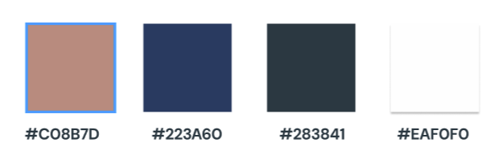

# Guia de Estilo 

### Histórico de Versões

|Versão|Data|Descrição|Autor(s)|
|---|---|---|---|
|1.0| 05/05/25 | criação inicial do documento de Guia de Estilo |[Luana Torres](https://github.com/luanatorress)|

<h1 style="text-align: center">Guia de Estilo</h1>

## 1 Cores:

#### Cores principais

   

<b>#C08B7D</b>

Utilizada em NavBars, Headers e botões relacionados a hóteis na aplicação.

   

<b>#223A60</b>

Utilizada em NavBars, Headers e botões principais e relacionados a voos na aplicação.

#### Cores secundárias

<b>#283841</b>

Utilizada para as fontes.

   

<b>#EAF0F0</b>

Utilizada no background, por ser um branco não tão brilhante.

## 2 Tipografia

Para os Headers será utilizada a fonte **Montserrat Bold**. 

A principal tipografia deverá ser **DM Sans Bold**, utilizada para todos os textos, exceto os Headers.

### 3 Referências

> EQUIPE ALECTRION 2023-1. Guia de Estilo. Disponível em: https://fga-eps-mds.github.io/2023-1-Alectrion-DOC/documentacao/guia-de-estilo/