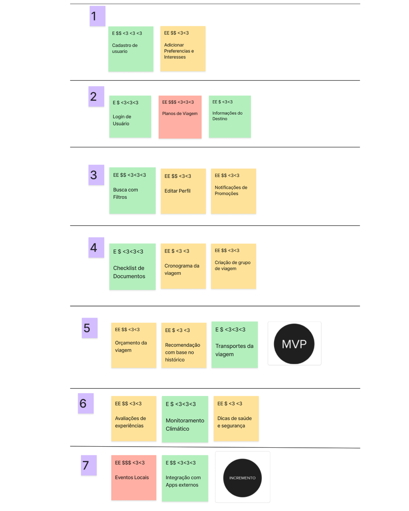

# Lean Inception 

## 1. Kick-Off 

A etapa de Kick-off marcou o início da Lean Inception do projeto Vai Pela Sombra, sendo fundamental para alinhar todos os participantes quanto ao propósito, escopo inicial e formas de trabalho colaborativo. Esse momento foi utilizado para nivelar o conhecimento sobre o contexto da aplicação — um app voltado à criação de itinerários personalizados para viajantes — e registrar ideias soltas, hipóteses e expectativas em um mural coletivo. Essa prática de “estacionamento de ideias”, inspirada por Caroli (2018), ajuda a abrir o espaço de escuta e criatividade, e serve como insumo para dinâmicas posteriores, como definição da visão do produto e brainstorming de funcionalidades. O Kick-off, nesse contexto, serviu não apenas como uma reunião de abertura, mas sim uma etapa estruturada de alinhamento inicial em torno da ideia central do produto.

Nesse contexto, ao final da atividade de Kick-off, organizamos os post-its em grupos temáticos de acordo com as funcionalidades sugeridas. As categorias definidas incluíram: funcionalidades voltadas ao usuário, à viagem em si, à gestão de preços, ao conceito de KYC (Know Your Customer), além de recursos sociais, ferramentas de busca e o destino final do itinerário. Para facilitar a priorização visual, utilizamos um sistema de cores: os post-its verdes representavam funcionalidades com alta probabilidade de implementação; os laranjas, ideias com potencial, mas pouco prováveis de entrarem no MVP; e os vermelhos, sugestões relevantes para o futuro, mas que estavam fora do escopo atual do projeto.

<em>Fonte: <a href="https://www.figma.com/board/TkllK6PIqr8cWuma3P36RG/Template-Lean-Inception---Backup?node-id=14945-1604&t=B6kTRge9GEBdl8zj-0">Template Lean Inception VaiPelaSombra</a></em>

## 2. Visão do Produto 

A etapa de Visão do Produto teve como objetivo esclarecer, de forma objetiva e compartilhada, qual problema o nosso projeto busca resolver, para quem ele é destinado e qual seu diferencial em relação às soluções já existentes. Utilizando o template clássico da Lean Inception proposto por Caroli (2018), desenvolvemos três visões distintas do nosso produto, cada uma representando um perfil de público-alvo com interesses e dores diferentes.

Na primeira visão, focamos no viajante comum, que enfrenta dificuldades em organizar sua viagem de forma eficiente. Para esse público, o Vai Pela Sombra é um site que reúne múltiplas funcionalidades em um só lugar, facilitando o acesso a informações e sugestões de itinerário personalizadas. O diferencial está em integrar funcionalidades que normalmente são fragmentadas em plataformas como Trivago ou 123Milhas.

<em>Fonte: <a href="https://www.figma.com/board/TkllK6PIqr8cWuma3P36RG/Template-Lean-Inception---Backup?node-id=14945-1604&t=B6kTRge9GEBdl8zj-0">Template Lean Inception VaiPelaSombra</a></em>

Na segunda perspectiva, voltada para empresas que desejam divulgar produtos ou serviços turísticos, a plataforma assume o papel de um site que conecta marcas a um público qualificado e segmentado. O foco é ajudar essas empresas a alcançar maior visibilidade com credibilidade e custo-benefício, se diferenciando de players como Booking.

<em>Fonte: <a href="https://www.figma.com/board/TkllK6PIqr8cWuma3P36RG/Template-Lean-Inception---Backup?node-id=14945-1604&t=B6kTRge9GEBdl8zj-0">Template Lean Inception VaiPelaSombra</a></em>

Por fim, na terceira visão, olhamos para o público de empresas que enviam funcionários em viagens corporativas. Nesse caso, o produto (denominado Viaja Fácil) é pensado como um aplicativo web voltado ao controle e planejamento de roteiros corporativos, proporcionando maior organização e redução de gastos com deslocamentos. Aqui, o diferencial está em permitir mais controle sobre as tarefas e horários dos colaboradores, indo além de soluções genéricas como as oferecidas por companhias como a LATAM.

<em>Fonte: <a href="https://www.figma.com/board/TkllK6PIqr8cWuma3P36RG/Template-Lean-Inception---Backup?node-id=14945-1604&t=B6kTRge9GEBdl8zj-0">Template Lean Inception VaiPelaSombra</a></em>

Essas três visões ajudaram o time a reconhecer o escopo multifacetado do projeto e refletir sobre possíveis modelos de negócio, além de direcionar futuras funcionalidades do MVP.

## 3. É, Não é, Faz, Não faz

A dinâmica "É / Não é / Faz / Não faz" teve como objetivo alinhar a identidade e os limites do produto entre os membros da equipe. Essa atividade é essencial para evitar ambiguidades e garantir que todos tenham uma compreensão comum do que está — e do que não está — dentro do escopo da solução. A equipe colaborou na construção de um quadro dividido em quatro quadrantes, detalhando as principais características e funcionalidades do Vai Pela Sombra.

No quadrante “É”, foram destacados elementos como: organizador de viagens, facilitador para empresas e viajantes, aplicação web e guia inteligente de destinos. Esses termos ajudaram a construir uma definição positiva e clara do produto.

Já no “Não é”, foram incluídos aspectos que o produto não pretende incorporar, como ser um app mobile, site de compra de passagens, mapa ou ferramenta focada exclusivamente em uma empresa. Também foi explicitado que o produto não é um canal de atendimento ou um blog por si só.

Na seção “Faz”, mapeamos funcionalidades previstas como: cadastro de usuários e empresas, sugestões de destinos e promoções, visualização de status de voos e integração com outros serviços. Além disso, o produto poderá futuramente incluir recursos de inteligência artificial para otimizar a experiência do usuário.

Por fim, o quadrante “Não faz” delimitou claramente o que está fora do escopo atual, como: check-in, seleção de assentos, remissão de bilhetes, pagamentos dentro da aplicação e upload de documentos oficiais. Essa definição ajuda a manter o foco no MVP e evitar desvios durante o desenvolvimento.

<em>Fonte: <a href="https://www.figma.com/board/TkllK6PIqr8cWuma3P36RG/Template-Lean-Inception---Backup?node-id=14945-1604&t=B6kTRge9GEBdl8zj-0">Template Lean Inception VaiPelaSombra</a></em>

## 4. Objetivos do Produto 

A etapa de Objetivos do Produto teve como propósito centralizar e priorizar os principais resultados que o projeto busca alcançar do ponto de vista funcional. Utilizando uma matriz visual colaborativa, os membros da equipe registraram as funcionalidades e benefícios que o produto deve oferecer, representando cada objetivo com post-its agrupados por afinidade.

Entre os principais objetivos levantados, destacam-se funcionalidades voltadas à planejamento inteligente de viagens, como a criação de roteiros personalizados, visualização e colaboração entre usuários, e o compartilhamento de itinerários. Também foram levantadas sugestões de valor agregado, como a recomendação de pontos turísticos, atividades locais, restaurantes e comércios próximos ao trajeto do viajante.

Além disso, aspectos relacionados à busca por preços vantajosos foram enfatizados, com ideias como comparação de preços, sugestão de promoções e monitoramento de passagens e hospedagens. Esse conjunto de objetivos reflete o esforço coletivo de entregar um produto robusto, que combine praticidade, personalização e economia para diferentes perfis de usuários.

<em>Fonte: <a href="https://www.figma.com/board/TkllK6PIqr8cWuma3P36RG/Template-Lean-Inception---Backup?node-id=14945-1604&t=B6kTRge9GEBdl8zj-0">Template Lean Inception VaiPelaSombra</a></em>

## 5. Personas

A construção de personas foi uma etapa essencial da Lean Inception do projeto Vai Pela Sombra, permitindo compreender melhor os diferentes perfis de usuários que podem interagir com o produto. Através de representações semi-fictícias, baseadas em comportamentos, dores e objetivos reais de públicos variados, a equipe pôde visualizar com mais clareza para quem o aplicativo está sendo desenvolvido e quais funcionalidades seriam mais relevantes para cada tipo de usuário.

Foram definidas três personas principais:

Cleunice, uma empresária de 42 anos, divorciada e mãe de dois filhos pequenos, representa a usuária exigente e ocupada, que busca praticidade, conforto e serviços premium. Ela precisa de um aplicativo que facilite a escolha de hospedagens adequadas para a família, com boa conectividade e opções diferenciadas.

<em>Fonte: <a href="https://www.figma.com/board/TkllK6PIqr8cWuma3P36RG/Template-Lean-Inception---Backup?node-id=14945-1604&t=B6kTRge9GEBdl8zj-0">Template Lean Inception VaiPelaSombra</a></em>

Adoniram, gerente de marketing de uma rede de pousadas, representa o parceiro comercial do projeto. Seu foco está em divulgar seus pacotes de forma eficiente, conectar-se a usuários e empresas, e oferecer visibilidade para seus serviços, com controle sobre períodos de alta e baixa temporada.

<em>Fonte: <a href="https://www.figma.com/board/TkllK6PIqr8cWuma3P36RG/Template-Lean-Inception---Backup?node-id=14945-1604&t=B6kTRge9GEBdl8zj-0">Template Lean Inception VaiPelaSombra</a></em>

Ronaldo, um barman de 28 anos, solteiro e sociável, simboliza o viajante jovem e espontâneo, que costuma viajar com amigos e busca soluções acessíveis, flexíveis e com boa relação custo-benefício. Ele valoriza locais que ofereçam estrutura para grupos e deseja praticidade na pesquisa de voos e hospedagens.

<em>Fonte: <a href="https://www.figma.com/board/TkllK6PIqr8cWuma3P36RG/Template-Lean-Inception---Backup?node-id=14945-1604&t=B6kTRge9GEBdl8zj-0">Template Lean Inception VaiPelaSombra</a></em>

## 6. Jornada do Usuário

A etapa de Jornada do Usuário teve como foco compreender, com maior profundidade, o contexto, as dores e as motivações dos diferentes perfis de personas durante a interação com o produto. A partir de um mapeamento visual, construímos quatro jornadas distintas, cada uma representando uma narrativa realista e cotidiana de como o Vai Pela Sombra pode se encaixar na vida do usuário, gerando valor prático em diferentes cenários.

Cleunice, uma empresária ocupada e estressada, encontra no Vai Pela Sombra uma forma de otimizar o tempo ao organizar suas férias com os filhos. A jornada dela mostra como o produto pode ser um alívio em um dia caótico, oferecendo praticidade mesmo em momentos de pressão.

<em>Fonte: <a href="https://www.figma.com/board/TkllK6PIqr8cWuma3P36RG/Template-Lean-Inception---Backup?node-id=14945-1604&t=B6kTRge9GEBdl8zj-0">Template Lean Inception VaiPelaSombra</a></em>

Adoniram, gerente de marketing de uma rede de pousadas, vivencia a necessidade de divulgar seus serviços de forma eficiente. Sua jornada revela como o Vai Pela Sombra atua como um canal estratégico para atrair novos clientes e estabelecer parcerias no setor de turismo.

<em>Fonte: <a href="https://www.figma.com/board/TkllK6PIqr8cWuma3P36RG/Template-Lean-Inception---Backup?node-id=14945-1604&t=B6kTRge9GEBdl8zj-0">Template Lean Inception VaiPelaSombra</a></em>

Ronaldo, um jovem barman sociável e descomplicado, organiza uma viagem em grupo com amigos. Sua experiência destaca o uso coletivo do aplicativo, a busca por promoções e a facilidade de comunicação que o produto proporciona entre usuários.

<em>Fonte: <a href="https://www.figma.com/board/TkllK6PIqr8cWuma3P36RG/Template-Lean-Inception---Backup?node-id=14945-1604&t=B6kTRge9GEBdl8zj-0">Template Lean Inception VaiPelaSombra</a></em>

Maria, uma usuária que decide embarcar em uma viagem de última hora com amigos, representa o comportamento impulsivo e colaborativo de alguns grupos. Sua jornada mostra como a funcionalidade de planejamento compartilhado do Vai Pela Sombra se destaca frente a ferramentas tradicionais.

<em>Fonte: <a href="https://www.figma.com/board/TkllK6PIqr8cWuma3P36RG/Template-Lean-Inception---Backup?node-id=14945-1604&t=B6kTRge9GEBdl8zj-0">Template Lean Inception VaiPelaSombra</a></em>

Essas narrativas revelam a amplitude de aplicação do produto, permitindo que o time de desenvolvimento visualize necessidades diversas — individuais, comerciais e sociais — e valide, por meio de empatia, a importância de priorizar funcionalidades que se encaixem nas rotinas reais dos usuários.

## 7. Revisão técnica, de negócio e de UX

A etapa de Revisão Técnica, de Negócio e de UX foi essencial para definir, entre as funcionalidades levantadas nas etapas anteriores, quais realmente fariam parte do MVP inicial. Utilizamos uma matriz de priorização com dois eixos principais: "o que fazer" (valor de negócio para o usuário) e "como fazer" (esforço técnico e de design), posicionando visualmente as ideias com base em seu custo, complexidade e impacto. Cada post-it foi avaliado a partir da sua viabilidade nas seguintes dimensões:

- Técnica: complexidade de implementação, necessidade de integrações e esforço de desenvolvimento.

- Negócio: valor percebido pelo usuário, impacto no modelo de monetização e vantagem competitiva.

- UX: utilidade, clareza de uso, aderência à experiência esperada.

As funcionalidades destacadas em verde (como cadastro de usuários, checklist de documentos e aba de roteiro em grupo) foram consideradas prioritárias e viáveis para entrega inicial. Já as ideias em amarelo representam recursos úteis, mas com dependências técnicas ou esforço moderado, ficando como possibilidades para iterações futuras. As ideias em vermelho foram mapeadas como custosas ou menos impactantes no momento atual, sendo registradas para avaliação posterior.

<em>Fonte: <a href="https://www.figma.com/board/TkllK6PIqr8cWuma3P36RG/Template-Lean-Inception---Backup?node-id=14945-1604&t=B6kTRge9GEBdl8zj-0">Template Lean Inception VaiPelaSombra</a></em>

## 8. Sequenciador

A etapa do Sequenciador foi utilizada para organizar, em ordem de prioridade e entrega, as funcionalidades levantadas nas fases anteriores da Lean Inception. A principal função dessa atividade foi ajudar o time a visualizar o que seria entregue no MVP, o que ficaria para ciclos posteriores e quais funcionalidades podem ser consideradas incrementais ao longo da evolução do produto.

A matriz foi organizada em 10 ciclos de entrega, considerando critérios como valor entregue ao usuário, complexidade técnica, alinhamento com os objetivos de negócio e experiência do usuário. Funcionalidades mais essenciais e viáveis — como cadastro de diferentes tipos de usuários, aba de roteiro personalizado, notificação de promoções, checklist de viagem e filtros de busca por preço/benefício — foram posicionadas nos primeiros ciclos e identificadas como parte do MVP.

Já recursos com maior grau de sofisticação, como integração com calendários, cronograma dinâmico, recomendações baseadas em avaliações e chat para auxílio no planejamento, foram alocados nos ciclos intermediários ou finais, sendo considerados como incrementos a serem desenvolvidos após a validação inicial do produto.

Primeira versão: 

Segunda versão, após ajustes no escopo: 

<em>Fonte: <a href="https://www.figma.com/board/TkllK6PIqr8cWuma3P36RG/Template-Lean-Inception---Backup?node-id=14945-1604&t=B6kTRge9GEBdl8zj-0">Template Lean Inception VaiPelaSombra</a></em>

## 9. Canvas MVP 

A etapa de construção do Canvas MVP teve como objetivo consolidar as principais definições levantadas ao longo da Lean Inception, estruturando de forma visual e objetiva os elementos centrais do produto mínimo viável (Minimum Viable Product). Essa ferramenta nos ajudou a alinhar a visão estratégica da entrega inicial, definindo escopo, público-alvo, métricas iniciais, funcionalidades e jornada esperada dos usuários.

A proposta do MVP é validar se os perfis levantados em personas realmente se engajam com a plataforma e encontram valor nas funcionalidades disponibilizadas. Para isso, o MVP contará com recursos como registro e visualização de roteiros de viagem, pesquisa de preços de estadias e passagens, e visualização de sugestões de pontos turísticos com comentários.

Os resultados esperados incluem a aquisição de 100 usuários e 500 downloads no primeiro mês, além de 300 roteiros registrados. Já as métricas de validação incluem número de roteiros cadastrados, número de usuários no sistema e volume médio de acessos semanais.

O custo e cronograma estimado para essa entrega inclui três meses de desenvolvimento, investimento de R$ 15 mil para desenvolvimento e R$ 5 mil para marketing e divulgação online.

<em>Fonte: <a href="https://www.figma.com/board/TkllK6PIqr8cWuma3P36RG/Template-Lean-Inception---Backup?node-id=14945-1604&t=B6kTRge9GEBdl8zj-0">Template Lean Inception VaiPelaSombra</a></em>

## 5. Referências

> CAROLI, Paulo. Lean Inception: Como alinhar as pessoas e construir o produto certo. 1. ed. atual. São Paulo: Caroli, 2018. ISBN 978-85-94377-06-7. E-book.

> SILVA, Danilo. Lean Inception na prática: um guia para facilitar sua primeira. Medium, 2021. Disponível em: https://medium.com/@danilolms/lean-inception-na-pr%C3%A1tica-um-guia-para-facilitar-sua-primeira-f0d69a67c60

> MOURA, Victor. Planejamento incremental e priorização de entregas com sequenciador. Medium, 2022. Disponível em: https://medium.com/@victormoura/sequenciador-na-lean-inception-como-funciona-331ccf4f23b0

> RIES, Eric. A Startup Enxuta: Como usar a inovação contínua para criar negócios radicalmente bem-sucedidos. Alta Books, 2012.

## 6. Histórico de versão

|Versão|Data|Descrição|Autor(s)|
|---|---|---|---|
|1.0| 18/05 | Adiciona conteúdo do Lean Inception |[Suzane Duarte](https://github.com/suzaneaduarte)|