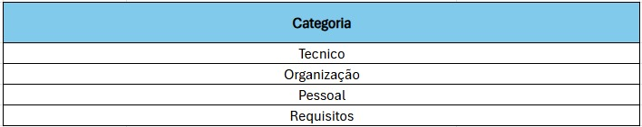
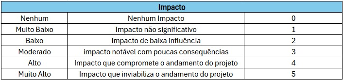
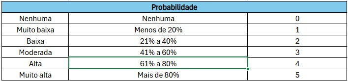

# Tracking de Riscos do Projeto

## Histórico de Revisão
| Versão | Data | Descrição | Autor(es)|
|:----:|:------:|:---------:|:--------:|
| 1.0 | 19/05 | Criação do artefato | [Pablo Guilherme](https://github.com/PabloGJBS)|
| 1.1 | 14/07 | Atualização no conteudo | [Pablo Guilherme](https://github.com/PabloGJBS)|

## Introdução

Durante as reuniões de *planning* e *review* realizadas com a equipe, foi conduzida uma análise dos possíveis riscos que poderiam impactar o projeto ao longo das sprints. Para isso, seguimos o modelo apresentado em sala de aula, no qual os riscos são classificados em quatro categorias: **Técnico**, **Organizacional**, **Pessoal** e **Requisitos**. Cada risco recebe uma avaliação de **impacto** e **probabilidade**, variando de 0 a 5, com o objetivo de mensurar sua relevância.

## Métricas

Para calcular o nível de preocupação associado a cada risco, utilizamos a seguinte fórmula:

**Score do risco = Impacto × Probabilidade**

Esse score é utilizado para priorizar os riscos e definir planos de contingência apropriados a partir dele temos uma classificação para o risco como : 

- Baixo (score 0 a 5)
- Médio (score 6 a 10)
- Alto (score 11 ou mais)

**Tabela de categoria**

**Tabela de Impacto**

**Tabela de Probabilidade**

## Tabela de Riscos

| Quando foi Identificado | Descrição                                                   | Categoria   |
| ----------------------- | ----------------------------------------------------------- | ----------- |
| Sprint 1                | Baixa participação em reuniões                              | Organização |
| Sprint 1                | Risco de provas de outras matérias atrapalharem os horários | Organização |
| Sprint 1                | Falta de energia                                            | Técnico     |
| Sprint 1                | Problemas de saúde                                          | Pessoal     |
| Sprint 1                | Risco de trancamento                                        | Pessoal     |
| Sprint 1                | Problema em Técnicos (computador queimar etc)               | Técnico     |
| Sprint 1                | Falta de conhecimento                                       | Requisitos  |
| Sprint 1                | Problemas pessoais                                          | Pessoal     |
| Sprint 1                | Falta de entrosamento entre o grupo                         | Organização |
| Sprint 1                | Sobrecarga de um grupo específico                           | Organização |
| Sprint 1                | Caos de final de semestre                                   | Organização |
| Sprint 2                | Não conseguir gerar Deploy                                  | Técnico     |
| Sprint 2                | Sobrecarga de membros específicos                           | Organização |
| Sprint 3                | Não conseguir finalizar uma US                              | Pessoal     |
| Sprint 4                | Não conseguir entregar o MVP                                | Organização |
| Sprint 5                | Provável greve de professores                               | Organização |
| Sprint 5                | Desistência                                                 | Pessoal     |
| Sprint 6                | Início do desenvolvimento das issues tardio                 | Organização |

## Tabela de riscos sprint 1

| Identificação | Probabilidade | Impacto | Score | Classificação   |
|---------------|---------------|---------|-------|-----------------|
| Risco 1       | 3             | 5       | 15    | Alta            |
| Risco 2       | 3             | 3       | 9     | Média           |
| Risco 3       | 1             | 2       | 2     | Baixa           |
| Risco 4       | 2             | 4       | 8     | Média           |
| Risco 5       | 2             | 5       | 10    | Média           |
| Risco 6       | 3             | 4       | 12    | Alta            |
| Risco 7       | 4             | 5       | 20    | Alta            |
| Risco 8       | 2             | 2       | 4     | Baixa           |
| Risco 9       | 3             | 2       | 6     | Média           |
| Risco 10      | 4             | 2       | 8     | Média           |
| Risco 11      | 3             | 2       | 6     | Média           |
| Risco 12      | 0             | 5       | 0     | Baixa           |
| Risco 13      | N             | N       | 0    | N         |
| Risco 14      | N             | N       | 0    | N          |
| Risco 15      | N             | N       | 0     | N         |
| Risco 16      | N             | N       | 0     | N         |
| Risco 17      | N             | N       | 0    | N          |
| Risco 18      | N             | N       | 0     | N         |

## Tabela de riscos sprint 2

| Identificação | Probabilidade | Impacto | Score | Classificação   |
|---------------|---------------|---------|-------|-----------------|
| Risco 1       | 2             | 5       | 10    | Média           |
| Risco 2       | 4             | 3       | 12    | Alta            |
| Risco 3       | 1             | 2       | 2     | Baixa           |
| Risco 4       | 2             | 4       | 8     | Média           |
| Risco 5       | 2             | 5       | 10    | Média           |
| Risco 6       | 3             | 4       | 12    | Alta            |
| Risco 7       | 3             | 5       | 15    | Alta            |
| Risco 8       | 3             | 2       | 6     | Média           |
| Risco 9       | 4             | 2       | 8     | Média           |
| Risco 10      | 1             | 3       | 3     | Baixa           |
| Risco 11      | 0             | 5       | 0     | Baixa           |
| Risco 12      | N             | N       | 0    | N         |
| Risco 13      | N             | N       | 0    | N         |
| Risco 14      | N             | N       | 0    | N          |
| Risco 15      | N             | N       | 0     | N         |
| Risco 16      | N             | N       | 0     | N         |
| Risco 17      | N             | N       | 0    | N          |
| Risco 18      | N             | N       | 0     | N         |

## Tabela de riscos sprint 3 

| Identificação | Probabilidade | Impacto | Score | Classificação   |
|---------------|---------------|---------|-------|-----------------|
| Risco 1       | 1             | 5       | 5     | Baixa           |
| Risco 2       | 4             | 3       | 12    | Alta            |
| Risco 3       | 1             | 2       | 2     | Baixa           |
| Risco 4       | 2             | 2       | 4     | Baixa           |
| Risco 5       | 2             | 5       | 10    | Média           |
| Risco 6       | 1             | 4       | 4     | Baixa           |
| Risco 7       | 4             | 4       | 16    | Alta            |
| Risco 8       | 3             | 2       | 6     | Média           |
| Risco 9       | 4             | 2       | 8     | Média           |
| Risco 10      | 3             | 2       | 6     | Média           |
| Risco 11      | 0             | 5       | 0     | Baixa           |
| Risco 12      | 3             | 5       | 15    | Alta            |
| Risco 13      | 3             | 4       | 12    | Alta            |
| Risco 14      | N             | N       | 0    | N          |
| Risco 15      | N             | N       | 0     | N         |
| Risco 16      | N             | N       | 0     | N         |
| Risco 17      | N             | N       | 0    | N          |
| Risco 18      | N             | N       | 0     | N         |

## Tabela de riscos sprint 4

| Identificação | Probabilidade | Impacto | Score | Classificação |
| ------------- | ------------- | ------- | ----- | ------------- |
| Risco 1       | 3             | 4       | 12    | Alta          |
| Risco 2       | 3             | 4       | 12    | Alta          |
| Risco 3       | 1             | 1       | 1     | Baixa         |
| Risco 4       | 3             | 2       | 6     | Média         |
| Risco 5       | 4             | 5       | 20    | Alta          |
| Risco 6       | 1             | 3       | 3     | Baixa         |
| Risco 7       | 3             | 4       | 12    | Alta          |
| Risco 8       | 3             | 3       | 9     | Média         |
| Risco 9       | 2             | 3       | 6     | Média         |
| Risco 10      | 1             | 1       | 1     | Baixa         |
| Risco 11      | 2             | 5       | 10    | Média         |
| Risco 12      | 4             | 4       | 16    | Alta          |
| Risco 13      | 3             | 2       | 6     | Média         |
| Risco 14      | 5             | 5       | 25    | Alta          |
| Risco 15      | N             | N       | 0     | N         |
| Risco 16      | N             | N       | 0     | N         |
| Risco 17      | N             | N       | 0    | N          |
| Risco 18      | N             | N       | 0     | N         |

## Tabela de riscos sprint 5

| Identificação | Probabilidade | Impacto | Score | Classificação |
| ------------- | ------------- | ------- | ----- | ------------- |
| Risco 1       | 3             | 4       | 12    | Alta          |
| Risco 2       | 3             | 4       | 12    | Alta          |
| Risco 3       | 0             | 1       | 0     | Baixa         |
| Risco 4       | 0             | 2       | 0     | Baixa         |
| Risco 5       | 0             | 2       | 0     | Baixa         |
| Risco 6       | 1             | 3       | 3     | Baixa         |
| Risco 7       | 2             | 3       | 6     | Média         |
| Risco 8       | 3             | 3       | 9     | Média         |
| Risco 9       | 2             | 3       | 6     | Média         |
| Risco 10      | 4             | 3       | 12    | Alta          |
| Risco 11      | 3             | 4       | 12    | Alta          |
| Risco 12      | 2             | 5       | 10    | Média         |
| Risco 13      | 5             | 5       | 25    | Alta          |
| Risco 14      | 3             | 4       | 12    | Alta          |
| Risco 15      | 5             | 5       | 25    | Alta          |
| Risco 16      | 3             | 5       | 15    | Alta          |
| Risco 17      | 3             | 5       | 15    | Alta          |
| Risco 18      | N             | N       | 0     | N         |

## Tabela de riscos sprint 6

| Identificação | Probabilidade | Impacto | Score | Classificação |
| ------------- | ------------- | ------- | ----- | ------------- |
| Risco 1       | 3             | 3       | 9     | Média         |
| Risco 2       | 4             | 4       | 16    | Alta          |
| Risco 3       | 0             | 1       | 0     | Baixa         |
| Risco 4       | 2             | 4       | 8     | Média         |
| Risco 5       | 0             | 0       | 0     | Baixa         |
| Risco 6       | 0             | 3       | 0     | Baixa         |
| Risco 7       | 2             | 3       | 6     | Média         |
| Risco 8       | 3             | 3       | 9     | Média         |
| Risco 9       | 3             | 3       | 9     | Média         |
| Risco 10      | 1             | 4       | 4     | Baixa         |
| Risco 11      | 2             | 5       | 10    | Média         |
| Risco 12      | 4             | 4       | 16    | Alta          |
| Risco 13      | 2             | 4       | 8     | Média         |
| Risco 14      | 4             | 5       | 20    | Alta          |
| Risco 15      | 1             | 5       | 5     | Baixa         |
| Risco 16      | 1             | 5       | 5     | Baixa         |
| Risco 17      | 4             | 4       | 16    | Alta          |
| Risco 18      | 4             | 4       | 16    | Alta          |

## Tabela de riscos sprint 7

| Identificação | Probabilidade | Impacto | Score | Classificação |
| ------------- | ------------- | ------- | ----- | ------------- |
| Risco 1       | 3             | 3       | 9     | Média         |
| Risco 2       | 4             | 4       | 16    | Alta          |
| Risco 3       | 0             | 1       | 0     | Baixa         |
| Risco 4       | 2             | 2       | 4     | Baixa         |
| Risco 5       | 0             | 0       | 0     | Baixa         |
| Risco 6       | 0             | 3       | 0     | Baixa         |
| Risco 7       | 2             | 3       | 6     | Média         |
| Risco 8       | 3             | 3       | 9     | Média         |
| Risco 9       | 2             | 3       | 6     | Média         |
| Risco 10      | 2             | 3       | 6     | Média         |
| Risco 11      | 1             | 4       | 4     | Baixa         |
| Risco 12      | 2             | 5       | 10    | Média         |
| Risco 13      | 3             | 4       | 12    | Alta          |
| Risco 14      | 4             | 4       | 16    | Alta          |
| Risco 15      | 2             | 5       | 10    | Média         |
| Risco 16      | 1             | 5       | 5     | Baixa         |
| Risco 17      | 1             | 5       | 5     | Baixa         |
| Risco 18      | 1             | 4       | 4     | Baixa         |

## Tabela de riscos sprint 8

| Identificação | Probabilidade | Impacto | Score | Classificação |
| ------------- | ------------- | ------- | ----- | ------------- |
| Risco 1       | 4             | 3       | 12    | Alta          |
| Risco 2       | 4             | 4       | 16    | Alta          |
| Risco 3       | 0             | 1       | 0     | Baixa         |
| Risco 4       | 2             | 2       | 4     | Baixa         |
| Risco 5       | 0             | 0       | 0     | Baixa         |
| Risco 6       | 1             | 2       | 2     | Baixa         |
| Risco 7       | 3             | 3       | 9     | Média         |
| Risco 8       | 2             | 3       | 6     | Média         |
| Risco 9       | 1             | 3       | 3     | Baixa         |
| Risco 10      | 2             | 3       | 6     | Média         |
| Risco 11      | 3             | 4       | 12    | Alta          |
| Risco 12      | 2             | 5       | 10    | Média         |
| Risco 13      | 4             | 4       | 16    | Alta          |
| Risco 14      | 1             | 5       | 5     | Baixa         |
| Risco 15      | 0             | 5       | 0     | Baixa         |
| Risco 16      | 0             | 5       | 0     | Baixa         |
| Risco 17      | 3             | 4       | 12    | Alta          |
| Risco 18      | 3             | 4       | 12    | Alta          |

## Tabela de riscos sprint 9

| Identificação | Probabilidade | Impacto | Score | Classificação |
| ------------- | ------------- | ------- | ----- | ------------- |
| Risco 1       | 3             | 3       | 9     | Média         |
| Risco 2       | 4             | 5       | 20    | Alta          |
| Risco 3       | 0             | 1       | 0     | Baixa         |
| Risco 4       | 2             | 3       | 6     | Média         |
| Risco 5       | 0             | 0       | 0     | Baixa         |
| Risco 6       | 1             | 2       | 2     | Baixa         |
| Risco 7       | 2             | 3       | 6     | Média         |
| Risco 8       | 3             | 4       | 12    | Alta          |
| Risco 9       | 1             | 3       | 3     | Baixa         |
| Risco 10      | 2             | 2       | 4     | Baixa         |
| Risco 11      | 5             | 4       | 20    | Alta          |
| Risco 12      | 2             | 5       | 10    | Média         |
| Risco 13      | 3             | 4       | 12    | Alta          |
| Risco 14      | 3             | 5       | 15    | Alta          |
| Risco 15      | 0             | 5       | 0     | Baixa         |
| Risco 16      | 0             | 5       | 0     | Baixa         |
| Risco 17      | 2             | 4       | 8     | Média         |
| Risco 18      | 2             | 4       | 8     | Média         |

## Tabela de riscos sprint 10

| Identificação | Probabilidade | Impacto | Score | Classificação |
| ------------- | ------------- | ------- | ----- | ------------- |
| Risco 1       | 3             | 3       | 9     | Média         |
| Risco 2       | 5             | 5       | 25    | Alta          |
| Risco 3       | 0             | 1       | 0     | Baixa         |
| Risco 4       | 2             | 3       | 6     | Média         |
| Risco 5       | 0             | 0       | 0     | Baixa         |
| Risco 6       | 1             | 2       | 2     | Baixa         |
| Risco 7       | 3             | 3       | 9     | Média         |
| Risco 8       | 3             | 4       | 12    | Alta          |
| Risco 9       | 1             | 3       | 3     | Baixa         |
| Risco 10      | 2             | 2       | 4     | Baixa         |
| Risco 11      | 5             | 5       | 25    | Alta          |
| Risco 12      | 4             | 5       | 20    | Alta          |
| Risco 13      | 3             | 4       | 12    | Alta          |
| Risco 14      | 5             | 5       | 25    | Alta          |
| Risco 15      | 4             | 5       | 20    | Alta          |
| Risco 16      | 0             | 5       | 0     | Baixa         |
| Risco 17      | 0             | 5       | 0     | Baixa         |
| Risco 18      | 2             | 4       | 8     | Média         |

## Tabela de riscos sprint 11

| Identificação | Probabilidade | Impacto | Score | Classificação |
| ------------- | ------------- | ------- | ----- | ------------- |
| Risco 1       | 3             | 3       | 9     | Média         |
| Risco 2       | 4             | 5       | 20    | Alta          |
| Risco 3       | 0             | 1       | 0     | Baixa         |
| Risco 4       | 1             | 3       | 3     | Baixa         |
| Risco 5       | 0             | 0       | 0     | Baixa         |
| Risco 6       | 1             | 2       | 2     | Baixa         |
| Risco 7       | 1             | 3       | 3     | Baixa         |
| Risco 8       | 2             | 4       | 8     | Média         |
| Risco 9       | 1             | 3       | 3     | Baixa         |
| Risco 10      | 2             | 2       | 4     | Baixa         |
| Risco 11      | 5             | 5       | 25    | Alta          |
| Risco 12      | 3             | 5       | 15    | Alta          |
| Risco 13      | 3             | 4       | 12    | Alta          |
| Risco 14      | 4             | 5       | 20    | Alta          |
| Risco 15      | 3             | 5       | 15    | Alta          |
| Risco 16      | 0             | 5       | 0     | Baixa         |
| Risco 17      | 0             | 5       | 0     | Baixa         |
| Risco 18      | 0             | 4       | 0     | Baixa         |

## Referências

> Pagina de riscos do Projeto PC-GO1 https://fga-eps-mds.github.io/2021.1-PC-GO1/metodologia/gerenciamentoRiscos/risco/

