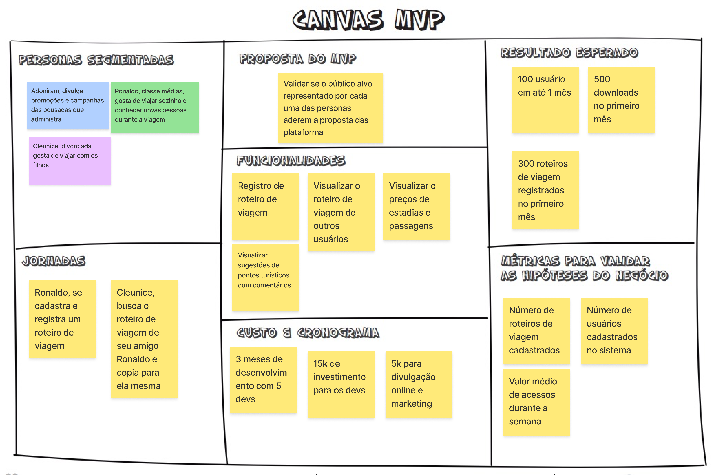

### Repositório do Docs: 
https://github.com/fga-eps-mds/2025.1-VaiPelaSombra-docs

### Lean inception: 
https://www.figma.com/board/TkllK6PIqr8cWuma3P36RG/Template-Lean-Inception---Backup?node-id=0-1&p=f&t=fEM5E9PRaHYOlsp4-0

(Não tem acesso? Lembre de usar uma conta de estudante com o email institucional)

    <iframe style="border: 1px solid rgba(0, 0, 0, 0.1);" width="800" height="450" src="https://embed.figma.com/board/TkllK6PIqr8cWuma3P36RG/Template-Lean-Inception---Backup?node-id=0-1&embed-host=share" allowfullscreen>
    </iframe>

### Canvas MVP:
Com base nas etapas do Lean Inception realizadas acima, foi elaborado o Canvas MVP abaixo:

    

### Backlog: 
https://www.figma.com/board/jNd881zfbb6mxiYaqT3eya/BackLog?node-id=0-1&p=f&t=wdSosRatpJg0053S-0 

    <iframe style="border: 1px solid rgba(0, 0, 0, 0.1);" width="800" height="450" src="https://embed.figma.com/board/jNd881zfbb6mxiYaqT3eya/BackLog?node-id=0-1&embed-host=share" allowfullscreen></iframe>

