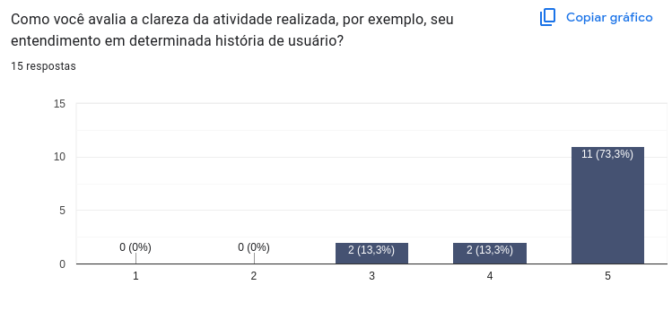
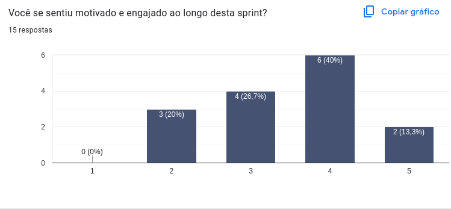
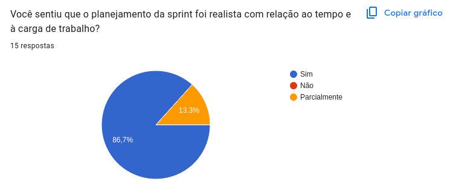
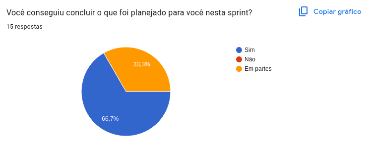

# Retrospective – Sprint 1

Este documento apresenta os principais resultados da retrospectiva na Sprint 1 do projeto **Vai Pela Sombra**, com base nas respostas dos membros da equipe por meio de um formulário. O objetivo da retrospectiva é refletir sobre o que funcionou bem, o que pode ser melhorado e alinhar expectativas para as próximas sprints.

## Histórico de Revisão
| Data | Versão | Descrição | Autor(es)|
|:----:|:------:|:---------:|:--------:|
| 05/05 | 1.0 | Adicionando sprint planning, retrospective e review | [Rennan](https://github.com/renannOgomes)|
| 06/05 | 2.0 | Adicionando conteúdo da Retrospective | [Suzane](https://github.com/suzaneaduarte)|

## Avaliações Coletivas

### Divisão de Tarefas

> **"Como você avalia a divisão de tarefas durante a sprint?"**

A maioria da equipe avaliou a divisão de tarefas de forma muito positiva. Dos respondentes, 6 atribuíram nota 4 e 9 deram nota máxima (5), demonstrando que houve uma distribuição equilibrada e clara das responsabilidades entre os membros.

---

### Clareza das Atividades

> **"Como você avalia a clareza da atividade realizada, por exemplo, seu entendimento em determinada história de usuário?"**

Os resultados apontam que a maioria dos membros compreendeu bem o que precisava ser feito. 11 pessoas deram nota 5, enquanto apenas 4 atribuíram notas mais baixas (3 e 4), o que indica que o processo de escrita e comunicação das histórias de usuário está bem encaminhado.

---

### Comunicação com o Time

> **"A comunicação com o restante do time foi eficaz?"**

Apesar de 7 membros considerarem a comunicação excelente (nota 5), houve uma parcela significativa de respostas medianas (notas 2 a 4). Isso sugere que, embora muitos tenham se comunicado bem, ainda existem oportunidades de melhorar os canais e a fluidez da comunicação entre os membros.

---

### Engajamento e Motivação

> **"Você se sentiu motivado e engajado ao longo desta sprint?"**

Os resultados mostraram um cenário misto. A maioria dos participantes deu notas entre 3 e 4, com apenas 2 notas máximas. Isso indica que, embora parte da equipe tenha se sentido motivada, fatores como sobrecarga acadêmica ou desafios técnicos podem ter impactado o engajamento de alguns.

---

### Planejamento Realista

> **"Você sentiu que o planejamento da sprint foi realista com relação ao tempo e à carga de trabalho?"**

A resposta foi majoritariamente positiva: 86,7% consideraram o planejamento adequado, e 13,3% responderam “parcialmente”. Isso mostra que o escopo e o tempo foram bem equilibrados para a maioria.

---

### Conclusão das Tarefas

> **"Você conseguiu concluir o que foi planejado para você nesta sprint?"**

Cerca de 67% dos participantes concluíram integralmente suas tarefas, enquanto os outros 33% relataram ter cumprido parte do que foi proposto. Isso reforça a necessidade de acompanhar o progresso individual e oferecer suporte durante o desenvolvimento.

---

## Avaliação Individual

> **"Como você avalia sua própria participação no time durante esta sprint?"**

As respostas abertas revelaram diferentes níveis de envolvimento: alguns membros destacaram sua contribuição direta no desenvolvimento de telas e apoio a colegas; outros reconheceram limitações por fatores externos, como problemas de saúde, compromissos acadêmicos ou falta de experiência. Muitos demonstraram autocrítica positiva, expressando o desejo de contribuir ainda mais nas próximas sprints.

Trechos representativos retirados das respostas recebidas no formulário:

> “Participei como pude, n sou tão experiente no Figma mas consegui trabalhar com meu time na criação das nossas telas, foi uma ótima experiência.”  
> “Foi razoável levando em consideraçao o pouco de conhecimento que tinha sobre assunto”  
> “Eu estava doente e melhorei apenas no dia da entrega, minha parte não ficou tão satisfatória.”
> "Acredito que eu poderia ter ajudado mais minha equipe."

---

## O Que Funcionou Bem

> **"O que funcionou bem nesta sprint?"**

Os principais pontos positivos citados pela equipe foram:

- A realização dos **DOJOs** (principalmente sobre Git e Figma), que ajudaram na aprendizagem prática.
- A **divisão de equipes**, que permitiu focar melhor em tarefas específicas.
- O apoio entre os membros, especialmente entre EPS e MDS.
- As **reuniões diárias** e o uso de ferramentas de comunicação como Discord.

Trechos representativos retirados das respostas recebidas no formulário:

> “O DOJO de Figma dessa sprint conseguiu auxiliar bem na introdução da ferramenta.”  
> “A comunicação interna entre os membros foi ótima.”  
> “O entendimento dos colegas de time facilitou o trabalho conjunto.”

---

## Sugestões de Melhoria

> **"Há algo que gostaria de sugerir como melhoria para a próxima sprint?"**

As sugestões indicam pontos importantes a serem ajustados:

- Melhorar a **comunicação em grupo**, com mais organização e clareza nos canais.
- **Definir mais claramente as tarefas individuais**, evitando sobreposição.
- Realizar **mais encontros presenciais** ou híbridos.
- Criar um **checklist de atividades** para acompanhar o progresso.
- Compartilhar **materiais de apoio** alinhados com as tecnologias utilizadas.
- Planejar de forma mais transparente entre EPS e MDS.

Trechos representativos retirados das respostas recebidas no formulário:

> “Uma explicação geral do código seria de grande ajuda.”  
> “Melhor planejamento e mais transparência com os MDS.”  
> “Definir melhor quem vai fazer o quê dentro de cada grupo.”

---

## Análise do Scrum Master

Durante a Sprint vários integrantes deixaram para contribuir no projeto apenas nos últimos dias da Sprint, algumas atitudes estão sendo discutidas para que isso não ocorra novamente. Algumas telas do protótipo deverão ser revisadas visto que alguns integrantes não seguiram o Guia de Estilo ou não entregaram algo satisfatório, condizente com as demais telas que foram desenvolvidas. 

---

## Conclusão

A Sprint 1 foi um começo promissor para o projeto, com boas práticas já sendo adotadas, como divisão de tarefas, uso de ferramentas colaborativas e apoio mútuo. Os feedbacks indicam que a equipe está engajada e consciente de seus pontos fortes e desafios. Com pequenos ajustes em planejamento, comunicação e organização, as próximas sprints tendem a ser ainda mais produtivas e colaborativas.

